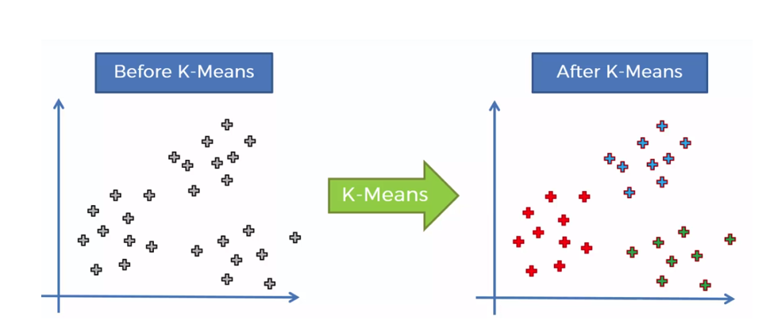
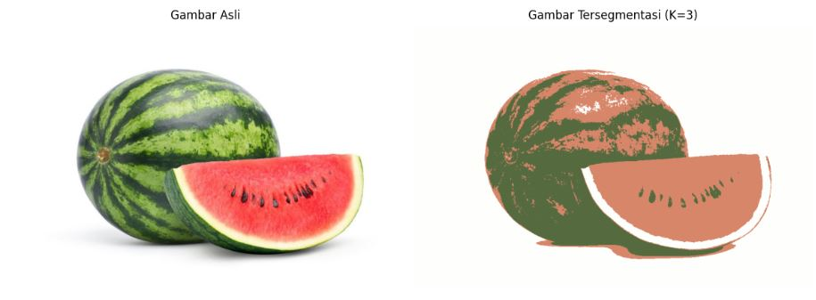

# UAS_PENGOLAHAN-CITRA

```py
Nama  : Muhamad Ali M
Nim   : 312210540
Kelas : TI.22.B2
```

## A. K-means Clustering

K-means Clustering adalah metode segmentasi gambar yang digunakan untuk mengelompokkan data (_piksel-piksel_) ke dalam sejumlah bagian (_cluster_) berdasarkan kesamaan warna, tekstur atau intensitasnya. Tujuannya adalah untuk menyederhanakan representasi gambar dan mempermudah analisis dengan mengelompokkan piksel yang memiliki karakteristik serupa ke dalam kluster yang sama.



# Penjelasan Program

- Berikut adalah program Python yang telah dirapikan dan dijelaskan setiap langkahnya. Program ini menggunakan OpenCV untuk memproses gambar melakukan clustering dengan algoritma k-means, dan menampilkan hasilnya menggunakan matplotlib..

# Penjelasan Program

- Berikut adalah program Python yang telah dirapikan dan dijelaskan setiap langkahnya. Program ini menggunakan OpenCV untuk memproses gambar melakukan clustering dengan algoritma k-means, dan menampilkan hasilnya menggunakan matplotlib..

```py
import numpy as np
import matplotlib.pyplot as plt
import cv2
image = cv2.imread('S.jpg')
image = cv2.cvtColor(image, cv2.COLOR_BGR2RGB)
plt.figure(figsize=(12, 6))
plt.subplot(1, 2, 1)
plt.imshow(image)
plt.title('Gambar Asli')
plt.axis('off')
pixel_vals = image.reshape((-1, 3))
pixel_vals = np.float32(pixel_vals)
criteria = (cv2.TERM_CRITERIA_EPS + cv2.TERM_CRITERIA_MAX_ITER, 100, 0.85)
k = 3
retval, labels, centers = cv2.kmeans(pixel_vals, k, None, criteria, 10, cv2.KMEANS_RANDOM_CENTERS)
centers = np.uint8(centers)
segmented_data = centers[labels.flatten()]
segmented_image = segmented_data.reshape((image.shape))
plt.subplot(1, 2, 2)
plt.imshow(segmented_image)
plt.title('Gambar Tersegmentasi (K=3)')
plt.axis('off')
plt.tight_layout()
plt.show()
```

# HASIL OUTPUT GAMBAR TERSEGMENTASI K=3



### TERIMA KASIH :D
