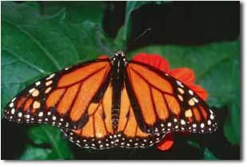
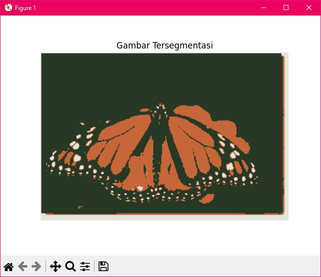
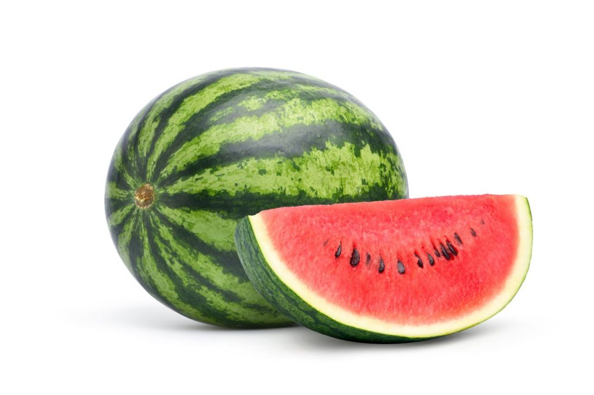

# UAS_PENGOLAHAN-CITRA

```py
Nama  : Muhamad Ali M
Nim   : 312210540
Kelas : TI.22.B2
```
## A. K-means Clustering
K-means Clustering adalah metode segmentasi gambar yang digunakan untuk mengelompokkan data (*piksel-piksel*) ke dalam sejumlah bagian (*cluster*) berdasarkan kesamaan warna, tekstur atau intensitasnya. Tujuannya adalah untuk menyederhanakan representasi gambar dan mempermudah analisis dengan mengelompokkan piksel yang memiliki karakteristik serupa ke dalam kluster yang sama.


# Penjelasan Program

- Berikut adalah program Python yang telah dirapikan dan dijelaskan setiap langkahnya. Program ini menggunakan OpenCV untuk memproses gambar melakukan clustering dengan algoritma k-means, dan menampilkan hasilnya menggunakan matplotlib..

## A. K-means Clustering

K-means Clustering adalah metode segmentasi gambar yang digunakan untuk mengelompokkan data (_piksel-piksel_) ke dalam sejumlah bagian (_cluster_) berdasarkan kesamaan warna, tekstur atau intensitasnya. Tujuannya adalah untuk menyederhanakan representasi gambar dan mempermudah analisis dengan mengelompokkan piksel yang memiliki karakteristik serupa ke dalam kluster yang sama.


# Penjelasan Program

- Berikut adalah program Python yang telah dirapikan dan dijelaskan setiap langkahnya. Program ini menggunakan OpenCV untuk memproses gambar melakukan clustering dengan algoritma k-means, dan menampilkan hasilnya menggunakan matplotlib..

```py
import numpy as np
import matplotlib.pyplot as plt
import cv2
%matplotlib inline
# unutk membaca gambar gunakan gambar sesuai dengan yg dimiliki
image = cv2.imread('monarch.jpg')
# Change color to RGB (from BGR)
image = cv2.cvtColor(image, cv2.COLOR_BGR2RGB)
plt.imshow(image)

# berfungsi untuk Membentuk ulang gambar menjadi susunan piksel 2D dan 3 nilai warna (RGB)
pixel_vals = image.reshape((-1,3))
# berfungsi untuk mengkonversikan ke tipe float
pixel_vals = np.float32(pixel_vals)

#baris kode di bawah ini menentukan kriteria agar algoritme berhenti berjalan,
#yang akan terjadi adalah 100 iterasi dijalankan atau epsilon (yang merupakan akurasi yang dibutuhkan)
#menjadi 85%
criteria = (cv2.TERM_CRITERIA_EPS + cv2.TERM_CRITERIA_MAX_ITER, 100, 0.85)
# lalu lakukan k-means clustering dengan jumlah cluster yang ditetapkan sebagai 3
#juga pusat acak pada awalnya dipilih untuk pengelompokan k-means
k = 3
retval, labels, centers = cv2.kmeans(pixel_vals, k, None, criteria, 10,
cv2.KMEANS_RANDOM_CENTERS)
# mengonversi data menjadi nilai 8-bit
centers = np.uint8(centers)
segmented_data = centers[labels.flatten()]
# membentuk ulang data menjadi dimensi gambar asli
segmented_image = segmented_data.reshape((image.shape))
plt.imshow(segmented_image)
```

# CONTOH 1



# MAKA HASIL NYA



# CONTOH 2



# MAKA HASIL NYA


